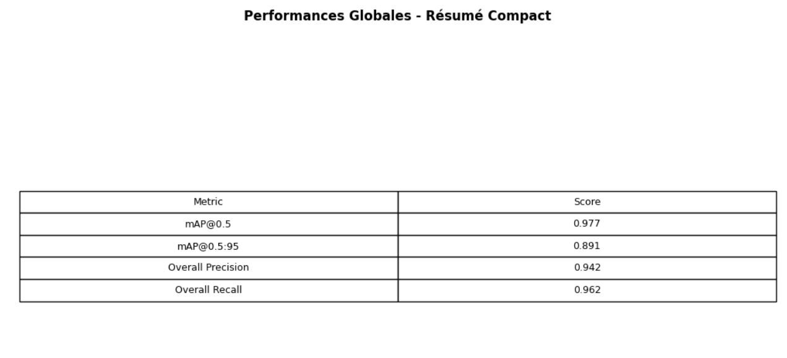

# Traffic Sign Detection with YOLOv8

Short description
Detects and classifies traffic signs using a YOLOv8 model trained on a Roboflow custom dataset. This repository contains the training notebook, a small inference utility, and an optional Gradio demo for quick testing.

Key highlights
- End-to-end notebook for downloading the dataset, training, evaluating and visualizing results.
- Trained model weights (kept locally) and inference helper script.
- Windows-friendly setup instructions in the Quickstart section.

## Contents

- `traffic_detection_project.ipynb` — Notebook containing dataset download, training, evaluation, and visualizations.
- `models/best_model.pt` — Trained model weights (not committed to the repo by default).
- `requirements.txt` — Project dependencies.


## 📊 Dataset

The project uses the Traffic Sign Recognition dataset from Roboflow with 14 classes:
crosswalk, direction, green, red
Speed limits: speed30, speed40, speed50, speed60, speed70, speed80, speed90, speed100, speed120,stop

Dataset Statistics:

Train: 1,475 images

Validation: 421 images

Test: 211 images

Total: 2,107 annotated images


## Evaluation metrics'results



## Quickstart (Windows PowerShell)

1. Create and activate a virtual environment:

```powershell
python -m venv .venv
.\.venv\Scripts\Activate.ps1
```

2. Install dependencies:

```powershell
python -m pip install --upgrade pip
pip install -r requirements.txt
```

Note: For GPU support, follow the official PyTorch instructions at https://pytorch.org to install a CUDA-compatible `torch` build.

## Configuration

- Roboflow (or other dataset services) typically require an API key. Do not commit keys to source control.
- Recommended: set the key as an environment variable before running the notebook or scripts:

```powershell
$env:ROBOFLOW_API_KEY = "YOUR_ROBOFLOW_KEY"
```

- Alternatively, create a local `.env` file and load it locally (this repo includes a `.gitignore` rule to ignore `.env`).

## Usage

- Run the notebook (`traffic_detection_project.ipynb`) in Jupyter or Colab and execute cells sequentially.
- To run a simple inference script (example):

```powershell
python inspect_model.py --weights models/best_model.pt --image path\to\image.jpg
# Expected: image with bounding boxes saved locally or printed JSON of detections
```


## Notes & troubleshooting

- `pycocotools` can be problematic to install on Windows; consider using conda or prebuilt wheels if pip install fails.
- If you use GPU training, ensure your CUDA version matches the installed `torch` wheel.
- Keep secrets out of source control. If an API key is accidentally committed, rotate it immediately and remove it from git history.

## Contributing

- Open issues for bugs or feature requests.
- Submit pull requests with tests or reproducible examples where possible.

## 🙏 Acknowledgments

Ultralytics for YOLOv8
Roboflow for the dataset
Google Colab for GPU resources


## 📞 Contact
amiridouaa3@gmail.com


